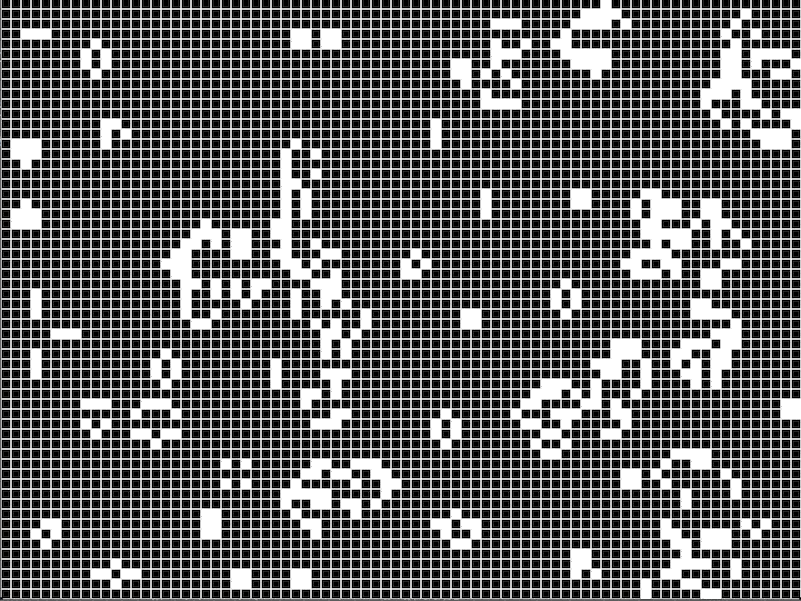

# golux

Game of Life in Elixir with [Scenic](https://github.com/boydm/scenic).

The game of life "engine" is [golex](https://github.com/vorce/golex) and golux simply visualises the model.

## Run it

`make run` (or simply `mix scenic.run`)

### Controls

- Left mouse click generates a new game
- Left keyboard arrow will decrease the speed of time
- Right keyboard arrow will increase the speed of time

## Notes

- Repo contains a bunch of things from the default scenic skeleton. I plan on removing
most of it.
